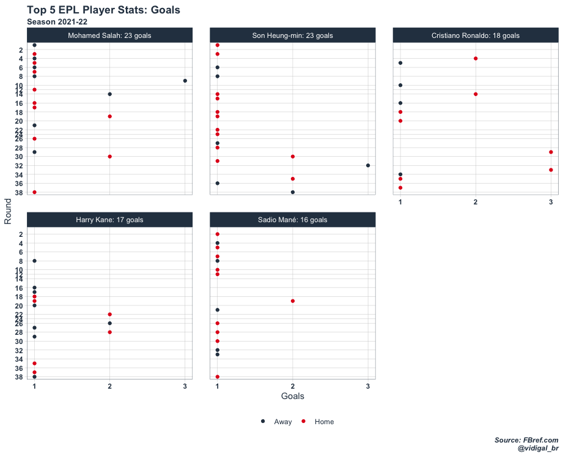
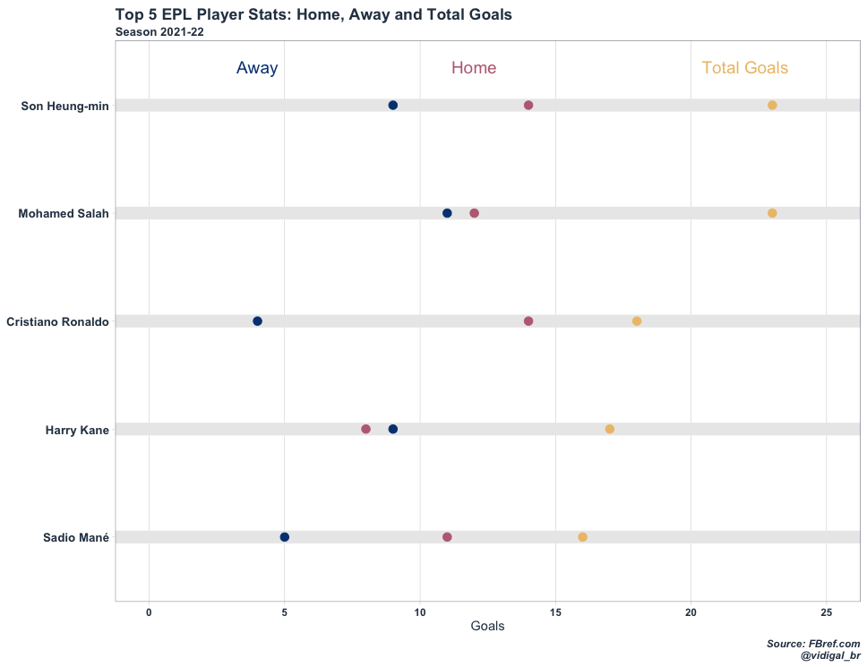

# English-Premier-League

This repository is intend to store some analysis regarding the EPL, just for fun purposes. I will be using the package **worldfootballR** to pull data from different sources and plot some graphics with **ggplot2** package.

## Goals Difference

Goals Difference (GD) is an important metric being the first tie-breaking criteria in case two clubs hit the same number of points. The plot below shows how the current (season 2021/22) EPL clubs have performed since season 2009/10.

## Goals

From round 30 onwards, Son was decisive scoring 11 goals (including a hat-trick) while Salah netted only 3 times.

